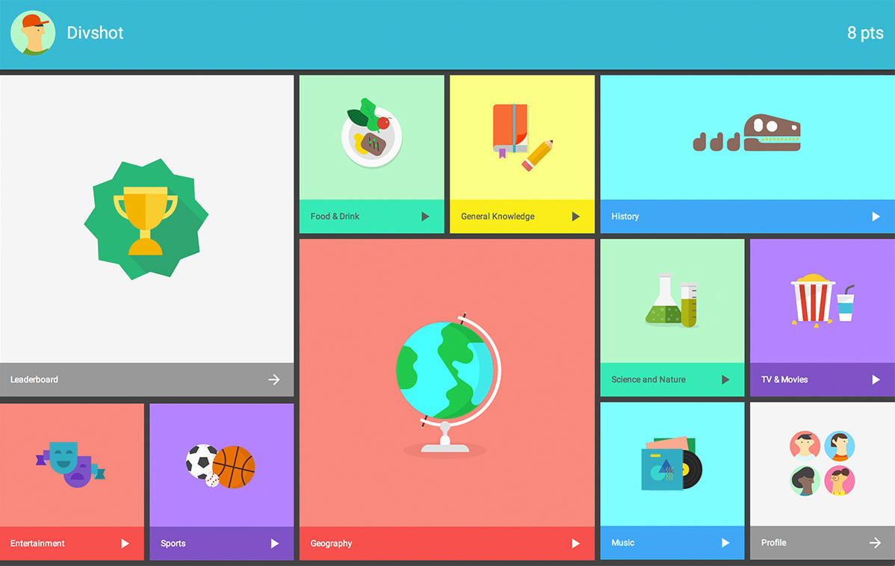

# Initiation au CSS
Amusons nous avec les DIV's !
Vous avez bien étudier le HTML et le CSS, il est temps de faire votre première maquette ! Dans le développement web, une maquette est l'image qu'un client vous donne et que vous devez reproduire en intégration.

Pour cet exercice il vous faudra donc transcrire en HTML et en CSS l'image ci-dessous.

Pour ce faire vous devrez utiliser Bootstrap. Ce n'est pas grave si les couleurs et les images ne sont pas identiques à celles de la maquette, ni si vous ne mettez pas les textes en forme de la même façon, ce qui compte pour cet exercice c'est surtout de bien pratiquer le principe des grilles de bootstrap. Pour les images, vous pouvez utiliser des icônes provenant de The Noun Project ou encore des images venant du site Placehold.it.  Vous pouvez également utiliser Pixabay, ou encore Subtle Patterns pour styliser selon votre goût, comme pour l'exercice de la semaine précédente.

Pour vous aider, voici quelques tips :

* Utilisez le principe des grilles de Bootstrap, expliqué ici.
* La zone header du haut n'a pas de classe bootstrap et fait 100% de la largeur
* La zone des tuiles en dessous est composée de trois colonnes ( 3 X 4 = 12 )
* la première colonne est composée de 3 blocs, le premier prenant toute la largeur (12 colonnes) et les 2 autres la moitié ( donc 2 X 6 )
* On ne vous détaille pas la logique pour la 2ème et la 3ème colonne, le principe est le même.

Bon courage et bon code ! :)

 

